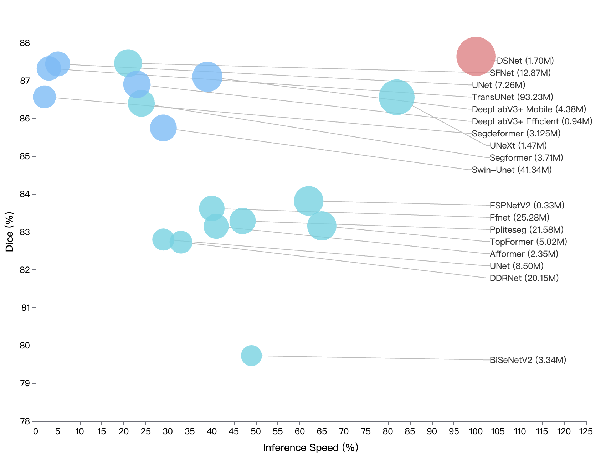
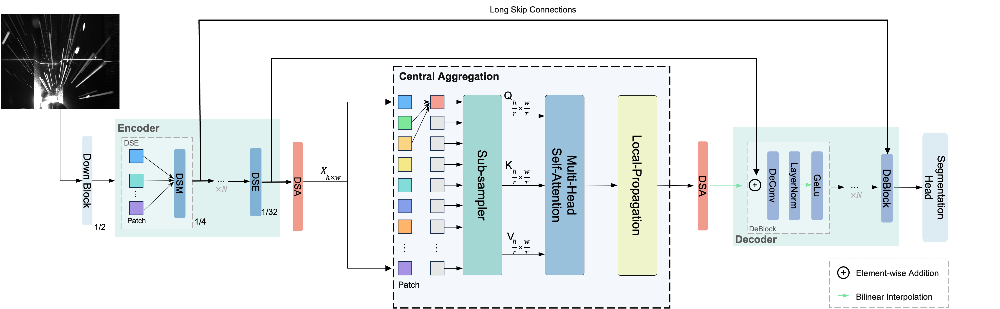
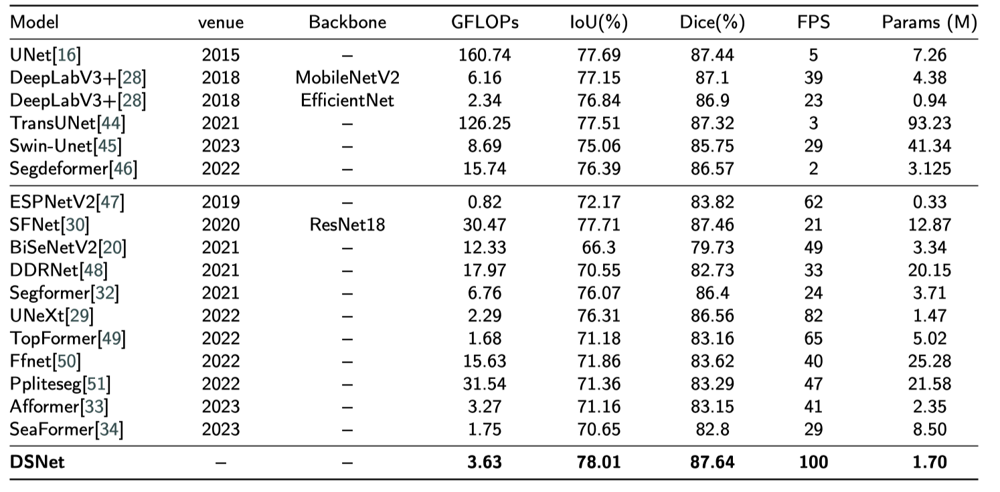

# DSNet: A Dynamic Squeeze Network for Real-time Weld Seam Image Segmentation

This repository contains the official implementation of DSNet.

## DSNet achieves superior trade-off between performance and latency

  

We present DSNet, an mannully designed semantic segmentation network with not only state-of-the-art performance but also faster speed than current methods.

## The overall architecture of DSNet

  

## Here is our speed-accuracy comparison on the weld seam dataset.

  

## Here is our speed-accuracy comparison on the weld seam dataset.
* Pytorch 2.1
* Python 3.8
* NVIDIA GPU
